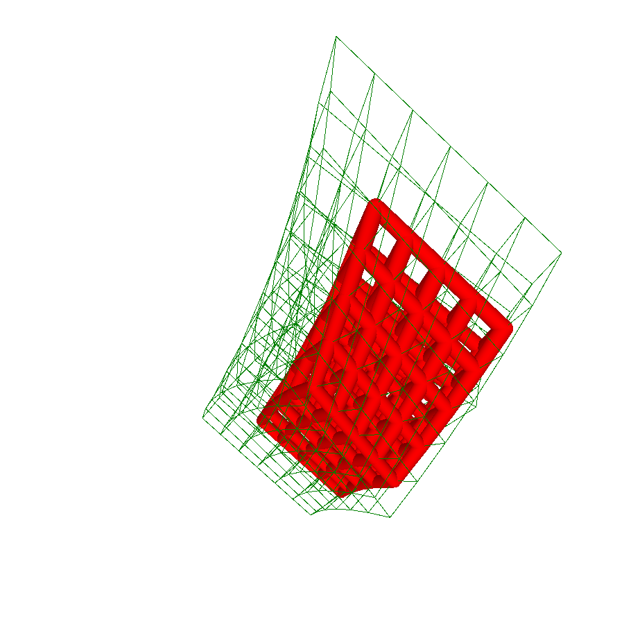
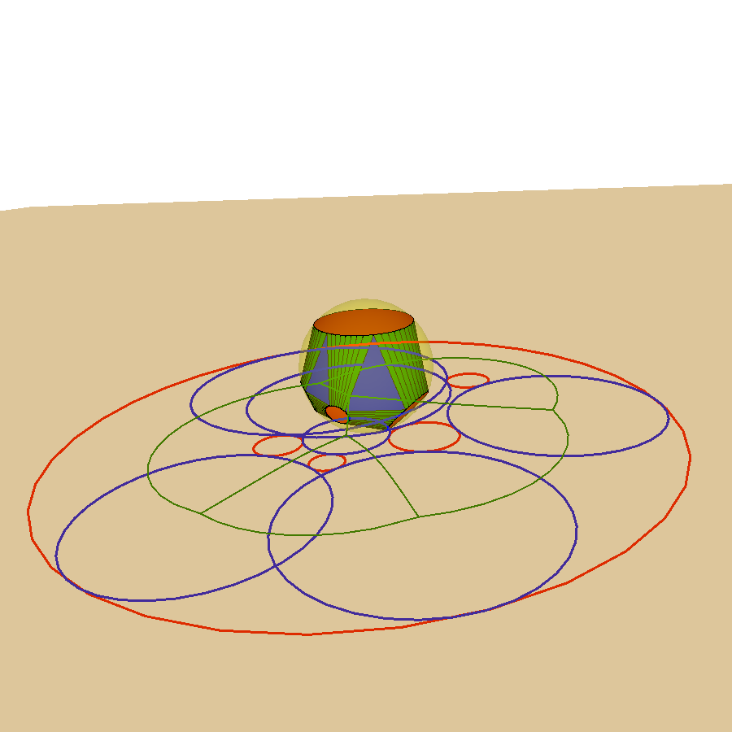

# Lattice-Triangulator

This project is intended to triangulate the boundary surface of a large-scale
lattice rapidly.

## Author

Yaohong Wu ywu669@gatech.edu

## Running the tests

The test number at the top of `latticeTriangulator.pde` corresponds to a specific
test. Detailed explanation and instructions about the most important tests are
listed below.

The camera views for the examples shown below are stored in `data/camera`. You can load a specific camera view by changing the camera path in line 43 of `gui.pde` to reproduce the corresponding result.

Each test has a set of control keys. Only some important keys are highlighted below. For more details, please look at `gui.pde` and the specific test function in `test.pde`.

General key controls:
- ' ': Press space and move mouse to rotate view.
- 's': Press 's' and move mouse to zoom in / out.
- 'o': Show / hide the yellow sphere (if it exists).

### Convex hull of co-spherical points
In `latticeTriangulator.pde`, specify the test number:
```
test = 0;
```
In `input.pde`, specify the input method and input file for the point set, e.g.,
```
int inputMethodPointSet = 0;  // 0: read from file, 1: generate randomly
String gPointSetPath = "data/point_set/ps_convex_hull_points";
```
The following picture shows the convex hull of co-spherical points using the above file path.


### Convex hull of sampled points on co-spherical circles
In `latticeTriangulator.pde`, specify the test number:
```
test = 1;
```
In `input.pde`, specify the input method and input file for the ring set, e.g.,
```
int inputMethodRingSet = 0;  // 0: read from file, 1: generate randomly
String gRingSetPath = "data/ring_set/rs_convex_hull_samples_on_circles";
```
The following picture shows the convex hull of samples on co-spherical circles using the above file path.


### Convex hull of co-spherical circles
In `latticeTriangulator.pde`, specify the test number:
```
test = 14;
```
In `input.pde`, specify the input method and input file for the point set, e.g.,
```
int inputMethodPointSet = 0;  // 0: read from file, 1: generate randomly
String gPointSetPath = "data/point_set/ps_convex_hull_circles";
```
The following picture shows the convex hull of co-spherical circles using the above file path, with gNumPointsPerRing being 25.


Keys:
- '1': Show / hide the red disks.
- '4': Show / hide the green corridors.
- '5': Show / hide the blue triangles.
- '+'/'-': Increase / decrease the number of samples on each circle.
- 'x' and drag: Drag the closest ball.
- 'i': Insert a ball.

### Tessellation of a hub
In `latticeTriangulator.pde`, specify the test number:
```
test = 20;
```
In `input.pde`, specify the input method and input file for the point set, e.g.,
```
int inputMethodPointSet = 0;  // 0: read from file, 1: generate randomly
String gPointSetPath = "data/point_set/ps_hub_tessellation";
```

A hub object is created from a set of spheres, including an inner sphere and
some outer spheres. Each outer sphere is created using two points *A* and *B*,
where *A* defines its center, and distance from *A* to *B* defines its radius.

#### Option 1: convert every quad into 2 triangles
In `test.pde`:
```
gUseTriQuadMesh = false;
```

The following pictures show: (a) a junction is approximated by a convex hull and beams are also approximated by convex hulls, (b) refine the mesh in (a) and project new vertices to hub, (c) each beam is approximated by a regular polygonal cylinder and there is a strip of triangles filling the gap between a beam and the junction, (d) refine the mesh in (c) and project new vertices to hub.


Keys:
- 'H': Show / hide the hub.
- 'B': Show / hide the inflating sphere.
- 'O': Show / hide intersecting circles, each of which is the intersection between a beam and the inflating sphere. A convex hull of these circles is created.
- 'S': Show / hide the strokes of triangles and corridors.
- 'T': Show / hide the tessellated convex hull.
- 'L': Show / hide lifted beams. Go to line 1142 in `test.pde` for more details.
- 'G': Show / hide the gap mesh.
- '[' / ']': Increase / decrease times of subdivision.
- 'P': Project newly inserted vertices on hub.
- '/' / '*': Change projection method. Go to line 442 in `mesh.pde` for more
  details.
-'9': Create gap or not.

#### Option 2: keep quads, use specific subdivision skemes for quads
In `test.pde`:
```
gUseTriQuadMesh = true;
```
Specify the subdivision skemes in line 1185 of `test.pde`:
```
gTriQuadMesh = gTriQuadMesh.subdivide(SubdivideTypeTriangle.LOOP, SubdivideTypeQuad.DIAMOND, gProjectOnCircleAfterSub);
```
Specify the projection method in line 1191 of `test.pde`:
```
gTriQuadMesh.projectOnHub(gHub, ProjectType.RAY);
```

The following pictures show: (a) subdivide each quad using DIAMOND scheme and push vertices on circles, (b) project new vertices on hub


Keys:
- 'H': Show / hide the hub.
- 'B': Show / hide the inflating sphere.
- 'O': Show / hide intersecting circles, each of which is the intersection between a beam and the inflating sphere. A convex hull of these circles is created.
- 'S': Show / hide strokes or triangles and corridors.
- 'T': Show / hide the tessellated convex hull.
- 'G': Show / hide the beams.
- '[' / ']': Increase / decrease times of subdivision.
- 'P': Project newly inserted vertices on hub.
- 'p': Push vertices to circles.


### Tessellation of a lattice
In `latticeTriangulator.pde`, specify the test number:
```
test = 24;
```
In `input.pde`, specify the input method and input file for the lattice, e.g.,
```
int inputMethodLattice = 0;  // 0: read from file, 1: generate manually
String gLatticePath = "data/lattice/lattice";
```
The following picture shows the mesh approximating the above lattice.


Keys:
- 'T': Show / hide the mesh.
- 'g': Show / hide the graph of the lattice.
- '+' / '-': Increase / decrease `gNumPointsPerRing`, and hence increase / decrease the resolution of corridors.

### Tessellation of a steady lattice
In `latticeTriangulator.pde`, specify the test number:
```
test = 25;
```
In `input.pde`, specify the input method for the steady lattice, e.g.,
```
int inputMethodSteadyLattice = 1;  // 1: generate manually
```
Note that this test is not robust for any steady lattice. Please also make sure that `gNumPointsPerRing` is bigger than 3.

The following picture shows the mesh of the selected portion of the steady lattice.



Keys:
- 'T': Show / hide the mesh.
- 'S': Show / hide the graph of the steady lattice.
- 'D' / 'd': Increase / decrease the size of the selected cube.
- 'I' / 'i': Increase / decrease the i-coordinate of the center of the selected cube.
- 'J' / 'j': Increase / decrease the j-coordinate of the center of the selected cube.
- 'K' / 'k': Increase / decrease the k-coordinate of the center of the selected cube.
- '+' / '-': Increase / decrease `gNumPointsPerRing`, and hence increase / decrease the resolution of corridors.

### Stereographic projection and 2D Apollonius diagram
In `latticeTriangulator.pde`, specify the test number:
```
test = 14;
```
In `input.pde`, specify the input method and input file for the point set, e.g.,
```
int inputMethodPointSet = 0;  // 0: read from file, 1: generate randomly
String gPointSetPath = "data/point_set/ps_stereo_Apollonius";
```
Please make sure that `gNumPointsPerRing` is big enough (e.g., 40).

The following picture shows the convex hull of co-spherical circles and the corresponding 2D Apollonius diagram.



Keys:
- 'P': Apply stereographic projection and get the 2D Apollonius diagram.
- '+' / '-': Increase / decrease `gNumPointsPerRing`, and hence increase / decrease the resolution of corridors.